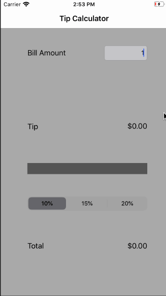

# Pre-work - *tipster*

**tipster** is a tip calculator application for iOS.

Submitted by: **Yamini Ponugoti**

Time spent: **1** hour spent in total

## User Stories

The following **required** functionality is complete:

* [ ] User can enter a bill amount, choose a tip percentage, and see the tip and total values.

## Video Walkthrough 

Here's a walkthrough of implemented user stories:

GIF created with [LiceCap](http://www.cockos.com/licecap/).
